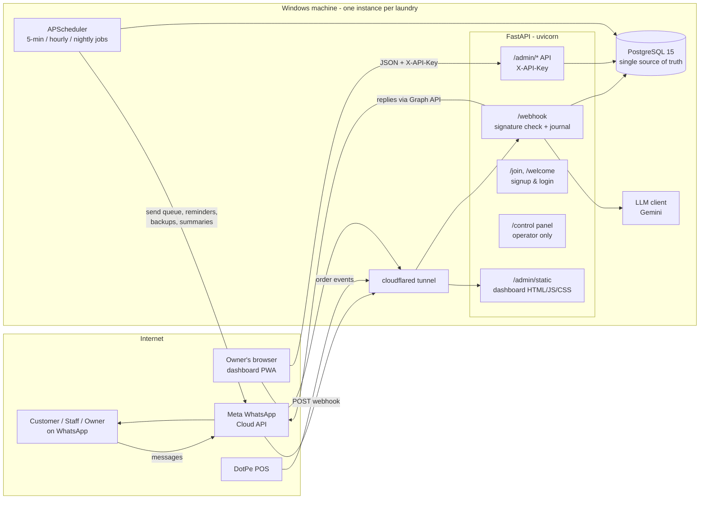
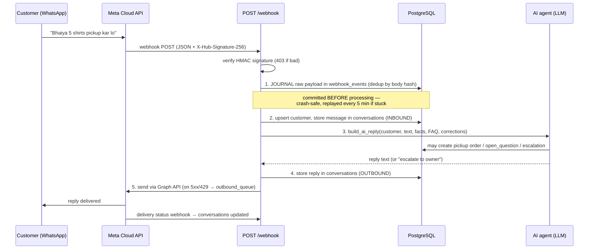
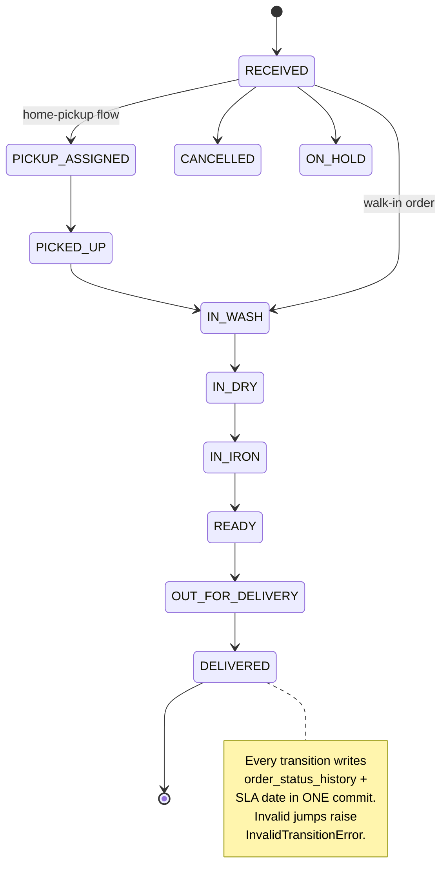
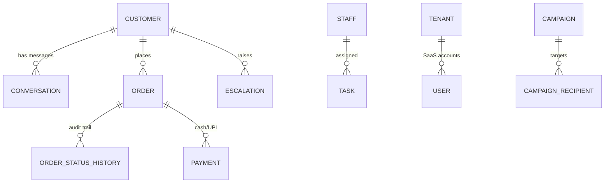

# KwikKlin Dashboard — Full Architecture & QA Guide

> Companion to [ARCHITECTURE.md](ARCHITECTURE.md) (scale & durability plan, in Hinglish).
> This file: the complete system picture — every component, every flow, with
> diagrams — plus a QA interview prep section at the end.

---

## 1. What this project is

**KwikKlin** is a WhatsApp-first CRM + operations system for laundry shops
(first customer: a laundry in Varanasi). There is no customer-facing app —
customers, the washer, and delivery staff all talk to **one WhatsApp number**.
An AI agent (LLM-powered) answers customers, creates pickup orders, escalates
to the owner when unsure. The owner runs the business from a **web dashboard**
(orders, inbox, expenses, billing, marketing, staff).

It is also being productised as a small SaaS: a public **pricing/signup page**
(`/join`), per-client onboarding, and an internal **control panel** for the
operator (plans, clients, revenue). Deployment model is **shared
multi-tenant**: one instance, one Postgres, every row carries `tenant_id`,
isolated by request context + ORM auto-filter + Postgres Row-Level
Security (see ARCHITECTURE.md §5).

## 2. Tech stack

| Layer | Technology | Where |
|---|---|---|
| API server | **FastAPI** (async) on **uvicorn**, single process | `app/main.py` |
| Database | **PostgreSQL 15**, SQLAlchemy 2 async ORM, **Alembic** migrations | `app/models/`, `alembic/` |
| Scheduler | **APScheduler** in-process (cron jobs, IST timezone) | `app/services/scheduler.py` |
| AI / LLM | Gemini (`gemini-3.5-flash` / `-flash-lite`) with Claude fallback names, JSON-schema outputs | `app/services/llm_client.py`, `ai_agent.py` |
| Messaging | **Meta WhatsApp Cloud API** (webhooks in, Graph API out) | `app/routers/webhook.py`, `app/services/whatsapp.py` |
| POS integration | DotPe webhook → normalised into the same pipeline | `app/routers/webhook.py`, `services/dotpe.py` |
| Frontend | Vanilla HTML/CSS/JS single-page dashboard (PWA + service worker), no framework, no build step (only minification) | `app/static/` |
| Ingress | **cloudflared tunnel** → local uvicorn (Windows machine) | `scripts/keepalive.ps1` |
| Tests | **pytest** (asyncio), ~340 tests across 35 files | `tests/` |
| Logging | structlog (structured JSON logs) | `app/utils/logger.py` |

## 3. High-level architecture



Key property: **everything durable lives in Postgres**. The dashboard is a
static shell that only sees data through the authenticated JSON API; the
scheduler and webhook handler are the only writers besides the admin API.

## 4. Repository layout

```
app/
  main.py            # FastAPI app: middleware, routers, static mount, /health
  config.py          # pydantic settings, all secrets from .env
  database.py        # async engine + session factory (pool 10+20, pre-ping)
  models/            # SQLAlchemy models (see §6)
  routers/
    webhook.py       # Meta + DotPe webhooks: verify, journal, process
    admin.py         # dashboard JSON API (/admin/*, X-API-Key)
    agent_admin.py   # AI-agent config: FAQ, corrections, training docs
    orders.py        # order CRUD + status transitions (/orders/*)
    account.py       # public signup/login/billing for new laundries
    control.py       # operator's own panel (clients, plans, revenue)
  services/          # all business logic (order_service, ai_agent, whatsapp,
                     # billing, escalation, marketing, backup, scheduler…)
  jobs/scheduler.py  # APScheduler bootstrap
  static/            # dashboard.html + app.js/app.css (PWA), join.html, sw.js
alembic/             # DB migrations (run on every startup via keepalive)
scripts/             # keepalive.ps1, seeders, minify, mobile screenshot checks
tests/               # ~340 pytest tests, DB-backed via conftest fixtures
backups/             # nightly pg_dump archives (14-day retention)
```

## 5. The flows (with diagrams)

### 5.1 Inbound WhatsApp message → AI reply



Notes a QA should know:

- **Journal-first**: the raw payload is committed to `webhook_events`
  *before* any processing. If the app crashes mid-processing, the
  5-minute durability job replays it (max 5 attempts, then `status='dead'`).
- **Dedup**: Meta retries webhooks; a body-hash prevents double-processing.
- **Voice notes** are transcribed; images get acknowledgement handling.
- Ratings ("5 star") are pattern-matched before hitting the LLM.
- The same pipeline serves **DotPe POS** events — they are reshaped into the
  Meta payload format (`_dotpe_to_meta_shape`) and journalled identically.

### 5.2 Order lifecycle (state machine)



Enforced in `app/services/order_service.py` — the API rejects transitions the
machine forbids, so a half-updated order can never exist.

### 5.3 Outbound message reliability

```
send_whatsapp() ──ok──▶ delivered, logged in conversations
      │
      └─ network error / 429 / 5xx
             │
             ▼
      outbound_queue row (status=pending)
             │  retried by durability job
             ▼  backoff 5 min → 6 h, max 8 attempts
      sent ✅   or   status='dead' (never silently dropped, kept for forensics)
```

Scheduled sends (reminders, follow-ups) additionally use **idempotency keys**
(`sent_events` table + claim/unclaim) so a message is never sent twice and a
key is never "burnt" by a permanent failure.

### 5.4 Dashboard flow

```
Browser ── GET /admin/static/dashboard.html (public shell, no data)
        ── app.js fetches /admin/... JSON with X-API-Key header
              • wrong key: constant-time compare, per-IP throttle
                (10 fails / 10 min → 429 even with the right key)
        ── responses GZip'd (~10x smaller over tunnel)
        ── assets cached forever (?v=<mtime>), HTML always revalidated
        ── PWA: manifest + service worker (/admin/sw.js) for mobile install
```

### 5.5 Background jobs (APScheduler, IST)

| Cadence | Job | What it does |
|---|---|---|
| Every 5 min | durability tick | replay stuck `webhook_events`, drain `outbound_queue` |
| Every 5 min | tunnel guard | check cloudflared, restart the tunnel if dead |
| Hourly | hourly tick | follow-up pings, delivery nudges, payment reminders, escalation checks (quiet hours respected) |
| Daily 21:00 | daily summary | owner gets a WhatsApp business summary |
| Daily 21:30 | nightly tick | `pg_dump -Fc` backup → `backups/` (14-day retention), marketing/social jobs |
| Morning | standup | staff task lists over WhatsApp |

All scheduled sends are idempotent via `sent_events`.

## 6. Data model (main tables)



Grouped by purpose:

- **Core ops**: `customers`, `conversations`, `orders`, `order_status_history`,
  `payments`, `rates`, `staff`, `tasks`, `expenses`, `escalations`
- **Durability**: `webhook_events` (inbound journal), `outbound_queue`
  (retry queue), `sent_events` (idempotency)
- **AI agent**: `faq_entries`, `corrections` (owner fixes a bad answer → agent
  learns), `doc_chunks` (training docs), `open_questions`, `llm_usage`
  (token/cost tracking), `settings_kv`
- **Marketing**: `leads`, `campaigns`, `campaign_recipients`, `coupons`,
  `coupon_redemptions`
- **SaaS**: `tenants`, `users`, `login_sessions`, `billing_events`
- **Audit**: `audit_log` (admin/agent/scheduler actions)

Indexes exist on every hot path (see ARCHITECTURE.md §4). All enums are
native Postgres ENUM types (`app/models/enums.py`).

## 7. Security model (summary)

| Surface | Protection |
|---|---|
| `/webhook` | Meta HMAC `X-Hub-Signature-256` verified on raw body; bad signature → 403; all token compares are `hmac.compare_digest` (timing-safe) |
| `/admin/*` API | `X-API-Key` constant-time compare + per-IP throttle (10 fails/10 min → 429) |
| Every response | `X-Content-Type-Options`, `X-Frame-Options: DENY`, `Referrer-Policy: no-referrer` (stops `?key=` media-URL leak), HSTS |
| Secrets | `.env` only, never in git; tokens masked as `••••••••` in API responses; saving a mask back never overwrites the real token |
| Prod hardening | `/docs` and `/redoc` disabled outside development |
| `/social/{name}` | strict filename allow-list (`social-*.png` only) — no path traversal |
| Audit | `audit_log` records who did what |

## 8. Reliability guarantees ("order kabhi lost nahi hota")

Layered, each independent — full detail in [ARCHITECTURE.md](ARCHITECTURE.md) §2:

1. **Inbound journal** (`webhook_events`) — commit before process, replay on crash
2. **Outbound queue** — retry with backoff, dead-letter, never silent drop
3. **Atomic transitions** — status + history + SLA in one commit
4. **Idempotency keys** — no double-sends
5. **Nightly `pg_dump`** — 14-day retention, restore drill documented
6. **Keepalive script** — Postgres → `alembic upgrade head` → uvicorn →
   cloudflared, health-checked every 5 min; survives reboots
7. **`/health`** — liveness + DB check; 503 means DB down (keepalive restarts
   the Postgres service, not the app)

---

## 9. QA Interview Questions & Answers

> Framing (important for you): *"The code was AI-assisted, but quality
> ownership is mine."* In an interview, present yourself as the person who
> defined what "correct" means, verified it, and owns the test strategy.
> Everything below is written in first person so you can speak it directly.

### Q1. Walk me through the project you tested.

**A.** It's a WhatsApp-based CRM for laundry businesses. Customers message a
WhatsApp number; Meta's Cloud API delivers those messages to our FastAPI
backend through a webhook. An AI agent replies, creates pickup orders, and
escalates to the owner when it's unsure. The owner manages orders, payments,
expenses and marketing from a web dashboard that talks to the same backend
over a key-authenticated JSON API. PostgreSQL is the single source of truth,
and a scheduler runs reminders, retries and nightly backups. My role was
end-to-end quality: API testing, the WhatsApp conversation flows, the order
state machine, data integrity, and the regression suite (~340 pytest tests).

### Q2. What was your overall test strategy?

**A.** Risk-based. The two things that must never fail are: (1) a customer
message must never be lost, and (2) an order must never end up in a wrong or
half-updated state. So my priorities were: webhook ingestion (including Meta's
retries and signature verification), the order status state machine, payment
totals, and the retry/idempotency machinery. Below that: dashboard API
contract testing, AI-reply quality checks, UI/PWA smoke tests on mobile, and
security checks (auth, headers, secrets masking). Automated regression runs in
pytest; exploratory testing I did through WhatsApp itself and the dashboard.

### Q3. How do you test a WhatsApp webhook? You can't control Meta's servers.

**A.** I don't need Meta to test my side. The webhook is just an HTTP POST
with a JSON body and an HMAC signature header. In tests we craft the same
payload Meta sends and sign it with the test app secret. I verify:
valid signature → 200 and message stored; tampered body or wrong signature →
403; duplicate delivery (Meta retries!) → processed only once thanks to the
body-hash dedup; malformed JSON → journalled but marked failed, not crashing
the server. For manual testing I used the real sandbox number end-to-end.

### Q4. What is idempotency and where did you test it?

**A.** Idempotency means doing the same operation twice has the same effect as
doing it once. Two places here: inbound, Meta re-delivers webhooks, so the
handler dedups by payload hash — I tested that replaying the exact same POST
doesn't create a second conversation row or a second order. Outbound, every
scheduled message claims a key in `sent_events` before sending — I tested that
running the reminder job twice sends one message, and that a permanent send
failure releases the key instead of burning it.

### Q5. How did you test the order status flow?

**A.** As a state machine. Valid path: RECEIVED → PICKUP_ASSIGNED → PICKED_UP
→ IN_WASH → IN_DRY → IN_IRON → READY → OUT_FOR_DELIVERY → DELIVERED, plus
CANCELLED and ON_HOLD as terminal side states. I tested every valid transition,
and — more importantly — invalid jumps (e.g. RECEIVED → DELIVERED), which must
return an error (`InvalidTransitionError`) and change nothing. I also verified
each transition writes a row to `order_status_history` and updates the SLA
date in the *same* transaction: if the API call fails, neither is written.

### Q6. What negative test cases did you design?

**A.** Wrong/absent API key on every admin endpoint (401/403); 11th wrong key
attempt from one IP → 429 even with the correct key; webhook with bad
signature → 403; duplicate webhook → no double-processing; invalid status
transitions; payments larger than the bill (allowed by design — customers pay
advance — so that's a *documented* behaviour, not a bug); garbage phone
numbers (normalisation is tested in `test_phone.py`); path traversal on the
public image route (`/social/../.env` must 404); saving the masked token
`••••••••` back must not overwrite the real secret.

### Q7. How do you test features powered by an LLM, where output is non-deterministic?

**A.** Three layers. First, unit tests **mock the LLM** — I test the
plumbing: the right context (customer facts, FAQ, corrections) goes in, the
reply gets stored and sent, order-creation tool calls hit the database
correctly. Second, **contract tests**: the LLM is asked for JSON matching a
schema; I test that invalid JSON is rejected/retried and never reaches the DB.
Third, **quality evals** (`test_agent_quality.py`): golden conversations with
assertions on behaviour — e.g. price questions must quote the rate card, the
agent must escalate instead of inventing an answer. I don't assert exact
strings; I assert properties of the answer.

### Q8. The developer says "it works on my machine." The webhook fails only in production. How do you debug?

**A.** This system journals every inbound payload in `webhook_events` with
status and error, so first I read the failing row — it has the raw body and
the exception. Typical causes: signature mismatch (wrong app secret in prod
`.env`), tunnel down (check `/health` and the tunnel-guard logs), or a payload
shape Meta changed. Because the journal keeps the raw payload, I can replay
the exact production request against a local instance and reproduce it. That's
the value of designing for testability — you never depend on Meta to resend.

### Q9. How did you test data integrity across a crash?

**A.** Kill-and-replay testing (automated in `test_durability.py`). Simulate a
crash between journalling and processing: the event sits in
`webhook_events` as pending, the 5-minute durability job replays it, and the
customer message appears exactly once. Same on the outbound side: fake a Meta
5xx, verify the message lands in `outbound_queue`, run the retry job, verify
it sends once and the queue row closes. After 8 failed attempts it must go to
`dead` status — visible for manual follow-up, never silently dropped.

### Q10. What API testing did you do, and with what tools?

**A.** The suite covers all routers: orders CRUD and transitions, inbox
threads with pagination limits, expenses, staff CRUD, billing, signup/login,
tenant isolation. For manual/exploratory API testing I used Postman
against the local server — auth headers, boundary values on `limit/offset`,
response codes and schemas. In CI it's pytest with an async test client and a
real Postgres, so queries, constraints and enums are exercised for real, not
mocked.

### Q11. What security testing did you perform?

**A.** Auth: constant-time key compare (no timing oracle), throttle
lockout behaviour, docs disabled in production. Headers: verified
`X-Frame-Options: DENY`, `nosniff`, `Referrer-Policy: no-referrer` — the last
one matters because media URLs carry `?key=` and the referrer would leak it.
Webhook HMAC verification with tampered bodies. Secrets: `.env` outside git,
tokens masked in responses, mask-write-back protection. Input: path traversal
on the public poster route, phone-number normalisation. I'd class it as
security-focused functional testing; a full pentest would be a separate scope.

### Q12. How do you test the scheduler jobs without waiting until 21:30 every night?

**A.** The jobs are plain async functions (`run_daily_summary`,
`run_payment_reminders`, …) that the cron triggers merely call, so tests
invoke them directly with a controlled clock and mocked WhatsApp sender. I
assert: right recipients, right content, quiet-hours respected, and
idempotency (running twice sends once). The cron wiring itself is a thin layer
I verify by inspection plus one manual observation.

### Q13. What does the regression suite look like? What runs before a release?

**A.** ~340 pytest tests in 35 files, grouped by feature: webhook, durability,
order service, pickup flow, inbox, billing, tenant isolation, agent quality,
media, notifications. They run against a real Postgres so migrations and
constraints are covered. Before release: full suite green, `alembic upgrade
head` on a copy of prod data, then a manual smoke: send a WhatsApp message
end-to-end, create an order from the dashboard, walk one status transition,
check `/health`. The nightly backup/restore path is drill-tested with
`pg_restore`.

### Q14. You said the code was written with AI assistance. As QA, how does that change your job?

**A.** It raises the value of QA. AI-generated code is fluent and *looks*
correct, so the failure mode shifts from obvious bugs to plausible-but-wrong
behaviour — edge cases, wrong assumptions, silent data issues. My job was to
own the definition of correct: I wrote/curated the acceptance criteria (the
state machine rules, the durability guarantees, the money math), built the
regression suite around them, and treated every AI-produced change as
untrusted until it passed those gates. Tools changed; accountability didn't —
the test oracle is human.

### Q15. Give me one real bug-shaped scenario from this project and how you'd catch it.

**A.** Double messages. Meta re-delivers webhooks whenever we're slow to ack —
so without dedup, a customer's "pickup kar lo" creates two orders and the
agent replies twice, which looks drunk. The catch: a test that POSTs the same
signed payload twice and asserts one conversation row, one order. A second
one: throttle lockout — after 10 wrong API keys from an IP, even the *right*
key gets 429 for that window. If you don't know that's intended, you'd file it
as a bug; knowing the spec, the test asserts it. That's why QA must own the
spec, not just click around.

### Q16. How would you test the multi-tenant part when it goes to 50–60 laundries?

**A.** It is a shared database, so isolation is something I have to *prove*,
not assume. Three layers (request context → ORM auto-filter → Postgres RLS
with FORCE) and a test per layer: `test_tenant_isolation.py` and
`test_data_isolation.py` (a user of shop A literally cannot read or write
shop B's rows, even with a crafted query), `test_rls_billing.py` (the DB
itself rejects a cross-tenant insert), `test_whatsapp_multitenant.py`
(inbound routing by `phone_number_id`, outbound uses the shop's own creds,
an unconnected shop never borrows the .env number), and
`test_scheduler_per_tenant.py` (background jobs run once per shop in that
shop's context; idempotency keys don't collide; a locked shop gets no
messages). The sharp edges are the places that *must* run cross-tenant —
control panel, Razorpay webhook, scheduler's platform half — so those are
tested for seeing everything while shop sessions see one thing.

---

*File maintained alongside the code. If a flow changes, update the diagram in
the same PR — a wrong diagram is worse than no diagram.*
